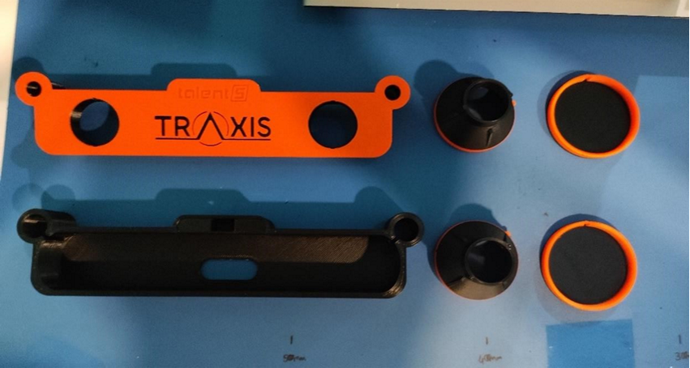
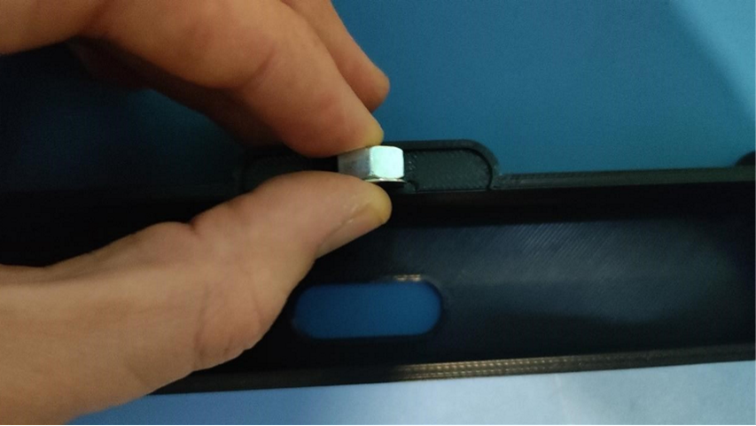
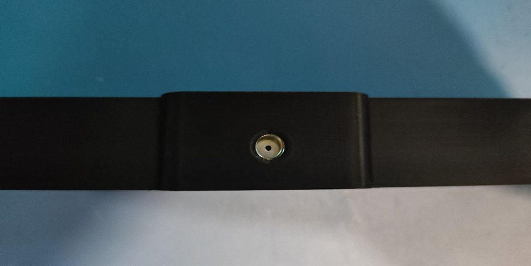
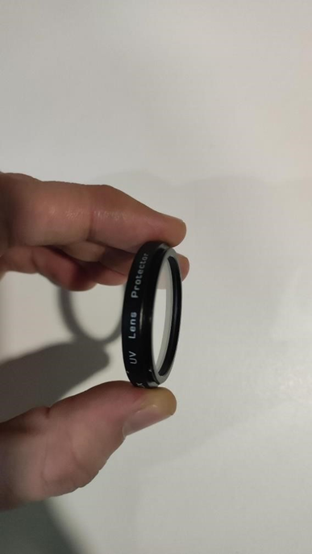
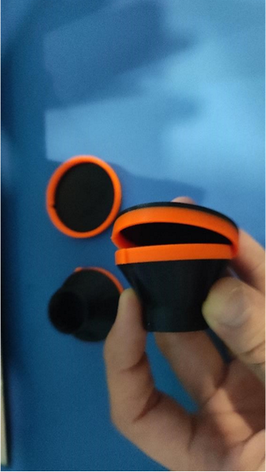
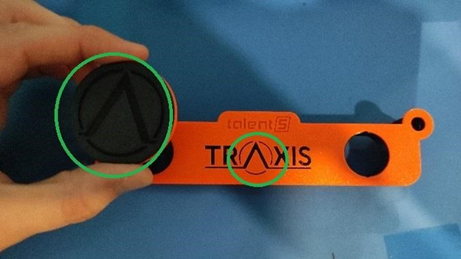
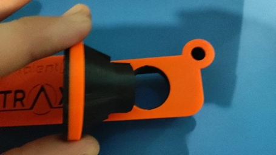
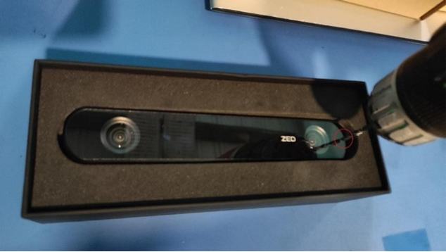
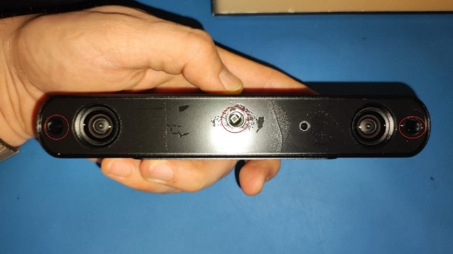

# Welcome to Zero Density Documents
## Traxis Setup
The first step is to prepare all of the 3D parts.

Place the nut and rondela on the back cover.

Make sure the nut and rondela are centered.

Provide UV filter mounting on leps caps. Close the lens caps.

|  |  |
|-----------------------|-----------------------|

Mount the lenses on the front cover, paying attention to the A logo

|  |  |
|-----------------------|-----------------------|

Drill a hole from the right side of the ZD logo. 
**(Right side of the lens)**

|  |  |
|-----------------------|-----------------------|

Remove the front cover of the Zed with the help of a screwdriver from the drilled hole.

